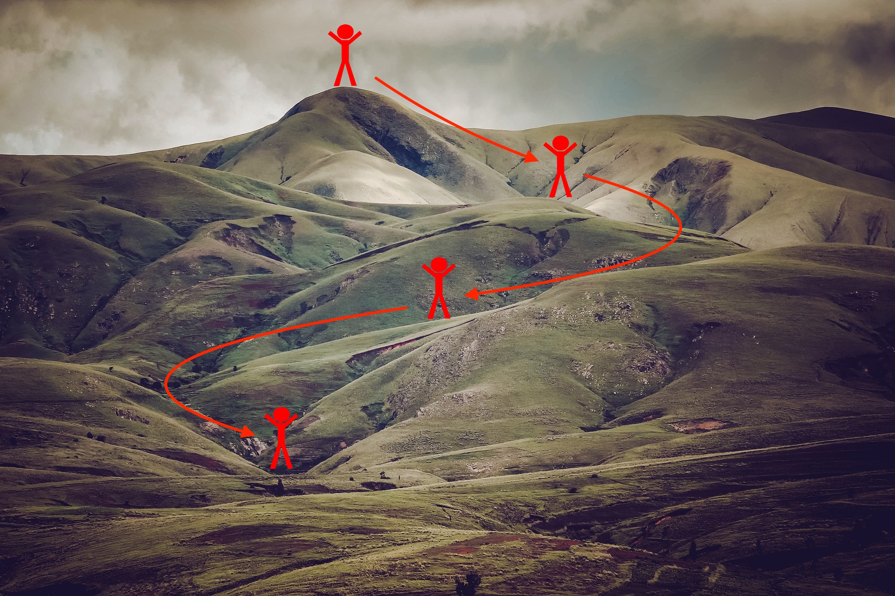

1)-Practical aspect of Deep Learning
Regularization
This  hyper parameters tuning specialization project. It is very important to  regularize model properly because it could dramatically improve results.
 <image src="Project/images/regularization.png">
In this project I have done following task:
- Understand that different regularization methods that could help your model.
- Implement dropout and see it work on data.
- Recognize that a model without regularization gives you a better accuracy on the training set but nor necessarily on the test set.
- Understand that you could use both dropout and regularization on your model.
 

2)Optimization

Welcome to the optimization's  of the hyper-parameters tuning specialization. There are many different optimization algorithms exist that can be used to get the minimal cost. Similarly, there are many different paths down this hill to the lowest point.

I have done following optimization to get the minimal cost:

- Understand the intuition between Adam and RMS prop

- Recognize the importance of mini-batch gradient descent

- Learn the effects of momentum on the overall performance of your model

3)
Tensorflow

In this notebook I have done all the basics of Tensorflow. I have done samething using numpy in my previous project. I have understand what Tensors and operations are, as well as how to execute them in a computation graph.

I have implemented deep learning models using Tensorflow using SIGNS dataset, I have build a deep neural network model to recognize numbers from 0 to 5 in sign language with a pretty impressive accuracy.

