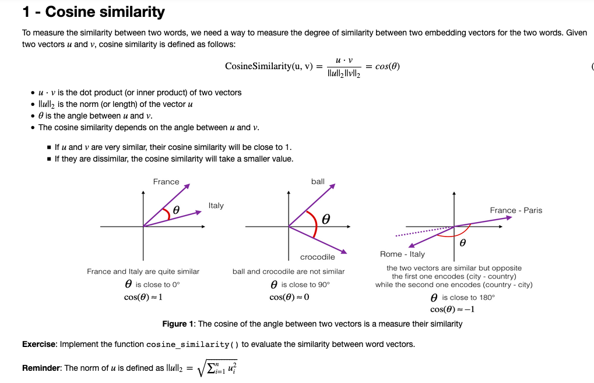
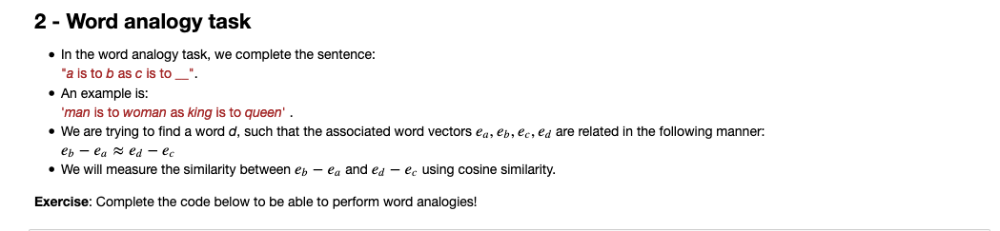
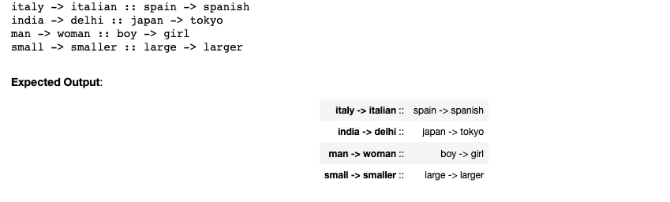
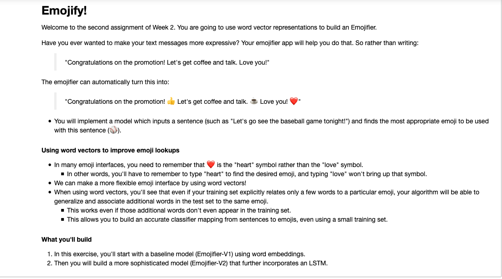

In this Project I have learned:

    If you have an NLP task where the training set is small, using word embeddings can help your algorithm significantly.
Word embeddings allow your model to work on words in the test set that may not even appear in the training set.
Training sequence models in Keras (and in most other deep learning frameworks) requires a few important details:
To use mini-batches, the sequences need to be padded so that all the examples in a mini-batch have the same length.
An Embedding() layer can be initialized with pretrained values.
These values can be either fixed or trained further on your dataset.
If however your labeled dataset is small, it's usually not worth trying to train a large pre-trained set of embeddings.
LSTM() has a flag called return_sequences to decide if you would like to return every hidden states or only the last one.
You can use Dropout() right after LSTM() to regularize your network.

