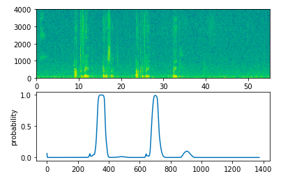

# First project Predict the name of dinosaurs
Welcome to Dinosaurus Island! 65 million years ago, dinosaurs existed, and in this assignment they are back. You are in charge of a special task. Leading biology researchers are creating new breeds of dinosaurs and bringing them to life on earth, and your job is to give names to these dinosaurs. If a dinosaur does not like its name, it might go berserk, so choose wisely! 

Luckily you have learned some deep learning and you will use it to save the day. Your assistant has collected a list of all the dinosaur names they could find, and compiled them into this dataset. (Feel free to take a look by clicking the previous link.) To create new dinosaur names, you will build a character level language model to generate new names. Your algorithm will learn the different name patterns, and randomly generate new names. Hopefully this algorithm will keep you and your team safe from the dinosaurs' wrath!

By completing this assignment you will learn:

    How to store text data for processing using an RNN
    How to synthesize data, by sampling predictions at each time step and passing it to the next RNN-cell unit
    How to build a character-level text generation recurrent neural network
    Why clipping the gradients is important

# Second project Emojification 

#Emojify 

   
In this Project I have learned:

    If you have an NLP task where the training set is small, using word embeddings can help your algorithm significantly.
Word embeddings allow your model to work on words in the test set that may not even appear in the training set.
Training sequence models in Keras (and in most other deep learning frameworks) requires a few important details:
To use mini-batches, the sequences need to be padded so that all the examples in a mini-batch have the same length.
An Embedding() layer can be initialized with pretrained values.
These values can be either fixed or trained further on your dataset.
If however your labeled dataset is small, it's usually not worth trying to train a large pre-trained set of embeddings.
LSTM() has a flag called return_sequences to decide if you would like to return every hidden states or only the last one.
You can use Dropout() right after LSTM() to regularize your network.

# Third project-Detection of Trigger word
Trigger Word Detection
Final programming assignment of this specialization!

In this assignment I have learned about applying deep learning to speech recognition. In this assignment, I have constructed a speech dataset and implement an algorithm for trigger word detection (sometimes also called keyword detection, or wake word detection).

Trigger word detection is the technology that allows devices like Amazon Alexa, Google Home, Apple Siri, and Baidu DuerOS to wake up upon hearing a certain word.
For this exercise, our trigger word will be "Activate." Every time it hears you say "activate," it will make a "chiming" sound.
By the end of this assignment, you will be able to record a clip of yourself talking, and have the algorithm trigger a chime when it detects you saying "activate."
After completing this assignment, perhaps you can also extend it to run on your laptop so that every time you say "activate" it starts up your favorite app, or turns on a network connected lamp in your house, or triggers some other event?

Model

Output -Detection of 'activate'

 

