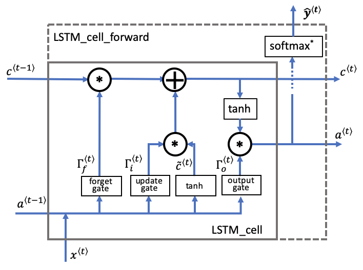

# BUILDING RNN STEP BY STEP
This implementation of  key components of a Recurrent Neural Network in numpy.

Recurrent Neural Networks (RNN) are very effective for Natural Language Processing and other sequence tasks because they have "memory". They can read inputs x⟨t⟩x⟨t⟩ (such as words) one at a time, and remember some information/context through the hidden layer activations that get passed from one time-step to the next. This allows a unidirectional RNN to take information from the past to process later inputs. A bidirectional RNN can take context from both the past and the future. 
1 - Forward propagation for the basic Recurrent Neural Network

Later this week, you will generate music using an RNN. The basic RNN that you will implement has the structure below. In this example, Tx=TyTx=Ty.

A recurrent neural network can be seen as the repeated use of a single cell. You are first going to implement the computations for a single time-step. The following figure describes the operations for a single time-step of an RNN cell. 

 Figure 2: Basic RNN cell. Takes as input x⟨t⟩x⟨t⟩ (current input) and a⟨t−1⟩a⟨t−1⟩ (previous hidden state containing information from the past), and outputs a⟨t⟩a⟨t⟩ which is given to the next RNN cell and also used to predict ŷ ⟨t⟩y^⟨t⟩
rnn cell versus rnn_cell_forward

    Note that an RNN cell outputs the hidden state a⟨t⟩a⟨t⟩.
        The rnn cell is shown in the figure as the inner box which has solid lines.
    The function that we will implement, rnn_cell_forward, also calculates the prediction ŷ ⟨t⟩y^⟨t⟩
        The rnn_cell_forward is shown in the figure as the outer box that has dashed lines.

Figure 3: Basic RNN. The input sequence x=(x⟨1⟩,x⟨2⟩,...,x⟨Tx⟩)x=(x⟨1⟩,x⟨2⟩,...,x⟨Tx⟩) is carried over TxTx time steps. The network outputs y=(y⟨1⟩,y⟨2⟩,...,y⟨Tx⟩)y=(y⟨1⟩,y⟨2⟩,...,y⟨Tx⟩).

2 - Long Short-Term Memory (LSTM) network

The following figure shows the operations of an LSTM-cell.

LSTM-cell. This tracks and updates a "cell state" or memory variable c⟨t⟩c⟨t⟩ at every time-step, which can be different from a⟨t⟩a⟨t⟩.
Note, the softmax∗softmax∗ includes a dense layer and softmax

Similar to the RNN example above, I have implemented the LSTM cell for a single time-step. Then you can iteratively call it from inside a "for-loop" to have it process an input with TxTx time-steps.

Forward pass for LSTM

Now that you have implemented one step of an LSTM, I can now iterate this over this using a for-loop to process a sequence of TxTx inputs.

